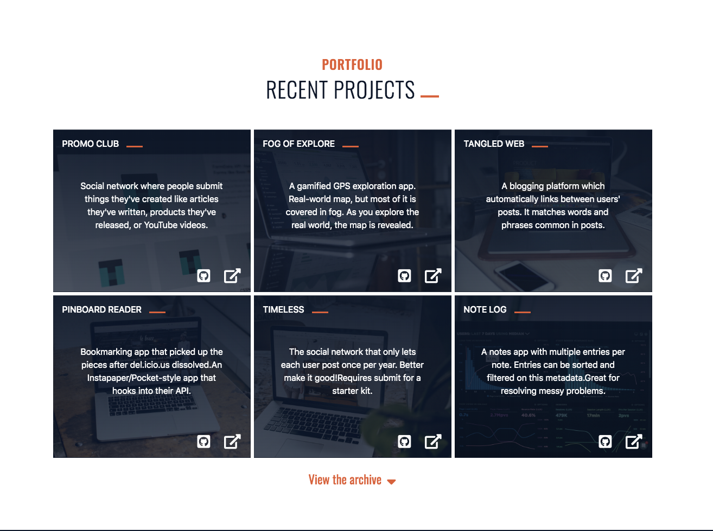
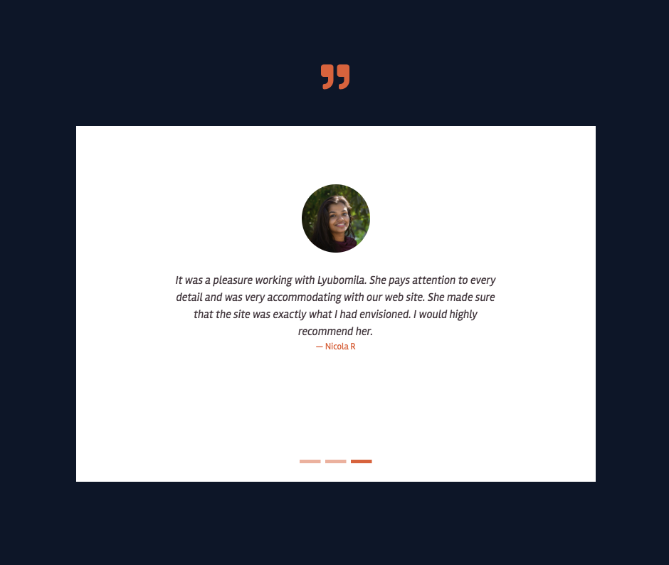
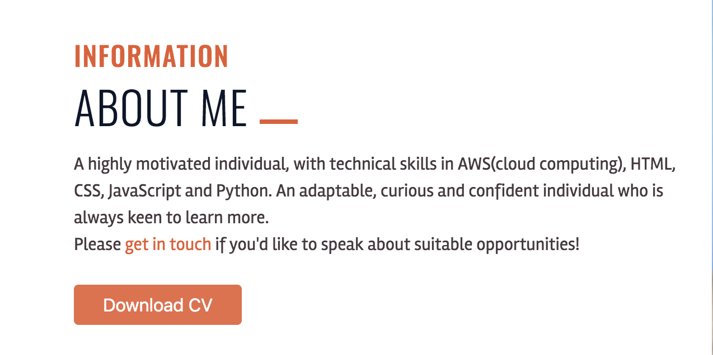

<h1 align="center">Lyubomila Petkova Portfolio</h1>


This is my portfolio website which will be used to share and showecase my work with potential employers.
The portfolio starts with a small About me section from where also my CV could be downloaded, continues with progress bars of my coding skills, followed by a list of recent projects sections and a drop-down archive list of previous projects (both recent and previous projects are fictional), finishing with a testimonial carousel and contact form. 

## User Experience (UX)

-   ### User stories

    -   #### Prospective Employer Goals

        1. As an employer I expect to see a showcase of Lyubomila's work. 

            
        
        2. As an employer I want to see testimonials giving a further indication of the quality of Lyubopmila's work. 

             


    -   #### Recruiter Goals

        As a recruiter I expect easily to find and export Lyubomila's CV.

        

-   ### Design

    -   #### Colour Scheme
        
        - The three main colors I have used in the portfolio are orange, blue and white.

    -   #### Typography

        - I have used three types of fonts: 
            - 'Oswald' with fallback on san-serif font;
            - 'Staatliches' with fallback on cursive;
            - 'Rambla'with fallback on san-serif font.

## Features

-   Responsive on all device sizes

-   Interactive elements

## Technologies Used

### Languages Used

-   HTML
-   CSS

### Frameworks, Libraries & Programs Used

1.  Bootstrap (4.3.1) 
- it was used to assist with the responsiveness and styling of the website.

1. Google Fonts 
- it was used to import the 'Oswald', 'Staatliches' and 'Rambla' font into the style.css.

1. Font Awesome 
- it was used on all pages throughout the website to add icons for aesthetic and UX purposes.

1. jQuery 
- used to make the navbar responsive but was also used for the smooth appearance of each section during the scrolling through the page.

1. Git 
- used for version control.

1. GitHub 
- used to store the projects code after being pushed from Git.

1. [Unsplash:](https://unsplash.com/) 
- All images on the website are downloaded from Unsplash.

## Testing

The W3C Markup Validator and W3C CSS Validator Services were used to validate every page of the project to ensure there were no syntax errors in the project.

### Testing User Stories from User Experience (UX) Section

The goals for prospective employer and recruiter are achieved. On loading the portfolio website there is easily readable navigation menu from which they can find the page of their choice. The the about me section they can find information about me as the option to download my CV via pressing a button which will load a new page with pdf document. If theye have any questions there is a hyperlink in the about me section which will direct them to the contact form. A showcase of projects that I have been working on can be find in recent projects section where are six cards with name of the project and short description as well as Font Awesome icons-links to the code in GitHub or live demo both of which will be opened in a new tab. Just below the projects cards they can find a drop dow button which on pressing will show a table with couple more projects, used tools and again Font Awesome icons-links to the code in GitHub or live demo both of which will be opened in a new tab. They are also able to view a carousel of slides with references from people who I was working previously and my social media profiles via clicking on the icons in the footer. 

### Further Testing

-   The Website was tested on Google Chrome, Internet Explorer, Microsoft Edge and Safari browsers.
-   The website was viewed on a variety of devices such as Desktop, Laptop, iPhone7, iPhone 8 & iPhoneX.


## Deployment

This site is hosted using GitHub pages, deployed directly from the master branch. 
This is a link to the [repository](https://github.com/Leoney/user-centric-frontend/) from where you can make a copy of it by forking or make a local clobe by simply pasting the below command into your terminal:

```
$ git clone https://github.com/Leoney/user-centric-frontend.git
```

## Credits

### Code

- I was using help from [Julio Codes](https://www.youtube.com/c/JulioCodes/about) channel and more specifiaclly for the header and navigation menu I was using this [tutorial](https://www.youtube.com/watch?v=M9BODcrzp4o).

- [Bootstrap4](https://getbootstrap.com/docs/4.4/getting-started/introduction/): Bootstrap Library used throughout the project mainly to make site responsive using the Bootstrap Grid System.

- The Code Institute Mini Project with Bootstrap 4 module. 

### Media

-   All Images were downloaded from [Unsplash](https://unsplash.com/)- source of freely-usable images.

### Acknowledgements

-   My Mentor for continuous helpful feedback.

-   Tutor support at Code Institute for their support.